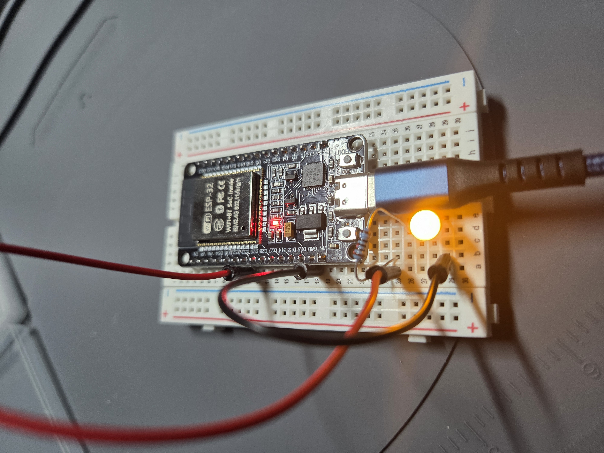

# 1-2-pwm-led-fade

Sunrise desk-lamp dimmer: an ESP32 fades an LED smoothly from off to full brightness and back over a continuous 3-second cycle, using PWM (LEDC) with no visible flicker or stepping.

## Status

- [x] Requirements defined
- [x] Components selected & BOM complete
- [x] Design calculations complete
- [x] Schematic captured (KiCad)
- [x] Prototype built & verified
- [ ] PCB ordered
- [ ] Assembled & bring-up tested

## Repo layout

```
CMakeLists.txt   ESP-IDF project root — open THIS folder to build/flash
main/            firmware source (app_main lives here)
sdkconfig.defaults
docs/            requirements, BOM, design calculations, test results, evidence
hardware/        KiCad schematic + PCB layout
```

## Lessons learned

<!-- Fill in as you go: what surprised you, what you'd do differently. -->

## Photos



[Fade demo video](docs/evidence/prototype-verification/PWM_LED.mp4)
